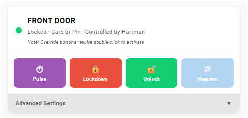
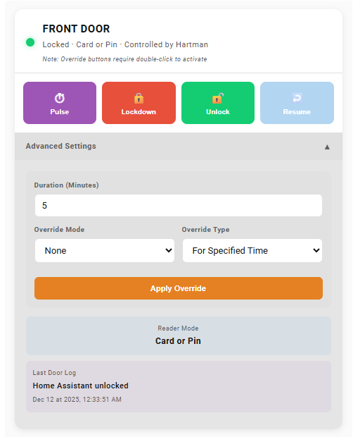
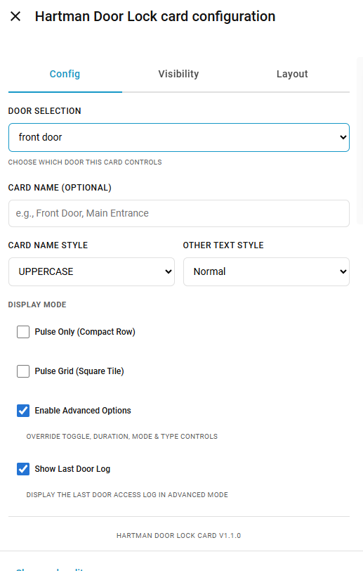
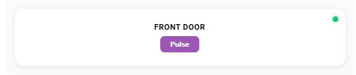

# Hartman Door Lock Card

A custom **Lovelace card for Home Assistant** to control **Hartman / Protector Net** door locks with a clean, modern, and feature-rich interface.

---

## Overview

The **Hartman Door Lock Card** provides an intuitive and powerful UI for managing door access directly from your Home Assistant dashboard.

It is designed for **shuls, mikvahs, schools, offices, and secure facilities** using Hartman / Protector Net access control systems.

### Key Highlights
- Multiple display modes (full, compact, grid)
- Quick action buttons (Pulse, Lockdown, Unlock, Resume)
- Advanced override controls with safety double-click
- Built-in visual editor
- Optional activity log
- Responsive and dashboard-friendly design

---

## Screenshots

### Full Card Mode
Complete control with status indicator and quick actions.

---

### Full Card Mode – Advanced Settings
Expanded view with override controls, duration, mode, and activity log.

---

### Visual Editor
Configure the card easily using the built-in visual editor.

---

### Pulse Only Mode (Compact Row)
Single-row display ideal for minimal dashboards.

---

### Pulse Grid Mode (Tile)
Square tile layout perfect for grids with multiple doors.

---

## Requirements

This card requires the **Hartmon Control** to be installed and configured:

👉 https://github.com/hitchin999/protector_net

---

## Features

- 🔒 **Quick Actions**  
  Pulse unlock, lockdown, unlock, and resume control

- 🎯 **Advanced Overrides**  
  Set duration, override mode, and override type

- 🛡️ **Safety Controls**  
  Override actions require double-click to activate

- 📊 **Live Status Indicator**  
  Color-coded lock and override states

- 📝 **Activity Log**  
  Optional last door access log with formatted timestamps

- 🎨 **Custom Styling**  
  Text casing options and layout flexibility

- 📱 **Responsive Design**  
  Works on mobile, tablet, and desktop dashboards

---

## Installation

### HACS Installation (Recommended)

1. Open **HACS**
2. Go to **Frontend**
3. Click the **three dots (⋮)** → **Custom repositories**
4. Add repository:
https://github.com/onoffautomations/HA_Harman_Lock_Card
5. Category: **Lovelace**
6. Install **Hartman Door Lock Card**
7. Restart Home Assistant

---

## Configuration

### Visual Editor
1. Add a new card
2. Search for **Hartman Door Lock Card**
3. Select your door
4. Configure options visually

---

